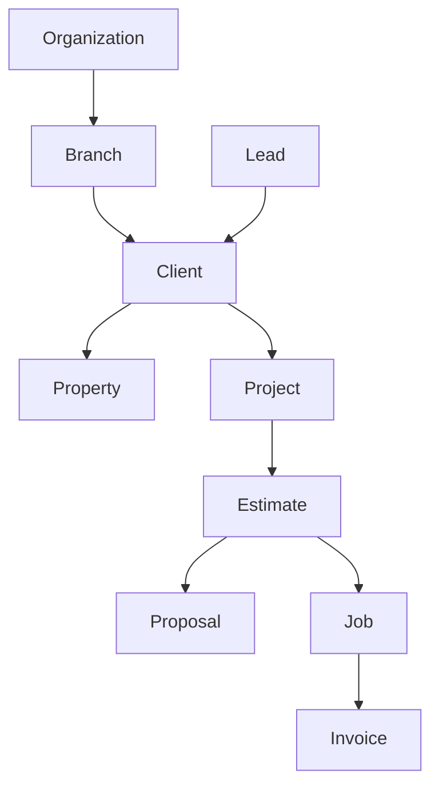

## The big container: where your company lives

### Organization

Your Organization is your whole company in Menaia. It holds everyone who works for you, all your customers, and every estimate and job. When you log in, you're working inside your organization.

### Branch

A Branch is a location or division within your organization — for example, a regional office or a service area. Branches let a larger company keep its pricing, settings, and teams organized separately while still rolling up into one company view.

<Tip>
  If your company runs more than one branch, you'll often see a **Branch / Company** toggle that lets you switch between viewing a single branch or the whole organization at once.
</Tip>

## The people: who you're working for

### Lead

A Lead is a potential customer who hasn't bought anything yet — a new inquiry, a referral, or someone who requested a quote. Leads are the top of your sales funnel. Your team works each Lead with the goal of turning it into real, won work.

### Client

A Client is an established customer — the person or household you're doing business with. A Lead becomes (or connects to) a Client once you're actively working with them. The Client record is the hub for everything tied to that customer: their contact details, their properties, and their history with you.

### Property

A Property is a physical location tied to a Client — usually the home or building where the work happens. One Client can have more than one Property, and each Property carries its own address and details, so the right crew shows up at the right place.

## The work: from idea to finished job

### Project

A Project groups together the work for a Client at a Property. It's the umbrella that ties related estimates, proposals, and jobs to one effort, so you always know which customer and address a piece of work belongs to.

### Estimate

An Estimate is your detailed, itemized pricing for a piece of work. You build it in the Calculator, which walks you through the work areas and items and does the pricing math for you. An Estimate captures _what_ the job involves and _what it costs_.

### Proposal

A Proposal is the polished, customer-facing version of an Estimate — the clean document you share with the customer to review, sign and approve. The Estimate is your working breakdown; the Proposal is what the customer sees and says "yes" to.

### Job

A Job is work the customer has agreed to. When an Estimate is sold, it becomes a Job: something real to schedule, assign to a crew, and complete. Jobs are where the work actually gets done and tracked.

### Shifts

Shifts are the events that you schedule on the calendar. They're assigned to people and appear in their "My Shifts" page to clock in and out of. These hours are tracked against the Job so you know how much time was spent completing it.

### My Wallet

My Wallet is where you track the bonuses you've earned. When a job finishes faster than its estimated hours, part of the time saved gets turned into a bonus and split among the crew based on hours worked on that job. Once the job closes, you'll see it show up here as a payout — along with any deductions from job-related expenses that come in afterward.

### Invoice

An Invoice is the bill you send for completed work. It's the final step — turning a finished Job into payment, and keeping a record of what's been billed and collected.

## How they fit together

## Where to go next

<CardGroup cols={2}>
  <Card title="How work flows" icon="arrow-right-arrow-left" href="/guides/start/how-work-flows">
    See these pieces in motion, from first contact to final payment.
  </Card>

  <Card title="Finding your way around" icon="compass" href="/guides/start/finding-your-way-around">
    Learn where each of these lives in the sidebar.
  </Card>
</CardGroup>