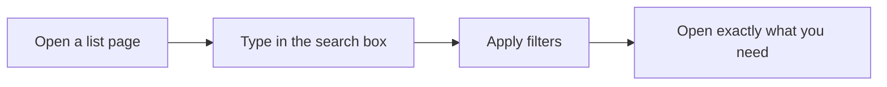

Menaia keeps everything in one consistent layout: a **sidebar** on the left to move between areas, and a main workspace that fills with whatever you're working on. Once you know how the sidebar is organized, you can find anything in a couple of clicks.

<Note>
Your sidebar only shows the areas your role can use, so it may be shorter than what you see here. That's normal — Menaia hides what you don't need.
</Note>

## Your dashboard: My Performance

When you log in, you land on **My Performance** — your personal dashboard. It's a quick read on how things are going, with results, leaderboards, and trends for you and your team. If your company runs more than one branch, a **Branch / Company** toggle lets you switch between one location and the whole organization, and you can change the time period to see today, this week, or longer.

<Tip>
Think of My Performance as your morning check-in: open it first to see where things stand before diving into the day's work.
</Tip>

## The sidebar, area by area

The sidebar groups related tools together so you can find them fast.

### Main

Your personal, everyday tools.

- **My Performance** — your dashboard of results and trends.
- **Schedule** — the calendar of upcoming and assigned work.
- **My Wallet** — your earnings and pay-related details.

### Sales

Everything for winning new work.

- **Leads** — new inquiries and potential customers.
- **Clients** — your established customers and their properties.
- **T&M Calculator** — a quick time-and-materials pricing tool.
- **Ride-Alongs** — capture and review field visits.
- **Estimates** — build, find, and manage itemized estimates.

### Jobs

Everything for getting the work done.

- **Jobs** — sold work to schedule, assign, and complete.
- **Shifts** — track the crew's time on the job.

### Admin

Company-wide oversight and setup (visible to managers and admins).

- **AI BI** — ask questions and explore trends across your business.
- **Bonus Report** — track and reward team performance.
- **Invoices** — bill completed work and follow payments.
- **Integrations** — connect Menaia to the other tools you use.
- **Settings** — manage your workspace, team, and preferences.

## Settings: tailoring your workspace

The **Settings** area (under Admin) is where your workspace is shaped to fit how your company works — your team and their access, branch details, pricing, and the preferences that drive the rest of the product. You'll usually visit Settings to set things up or adjust them, not for day-to-day work.

<Tip>
If something in Menaia behaves differently than a teammate's — like a step that appears for them but not you — it's often a **branch setting**. Settings is where those differences are configured.
</Tip>

## Finding things fast with search

Most list pages — **Leads**, **Clients**, **Estimates**, **Jobs**, **Invoices** — give you a **search box** and **filters** at the top. Type a name, address, or keyword to narrow a long list down to what you're after, and use filters to focus on a status, a person, or a time range.

<Tip>
Looking for one specific customer? Start in **Clients** and search their name — from there you can reach their properties, estimates, and jobs all in one place.
</Tip>

## Where to go next

<CardGroup cols={2}>
  <Card title="Core concepts" icon="shapes" href="/guides/start/core-concepts">
    Brush up on the building blocks behind each sidebar area.
  </Card>
  <Card title="Roles at a glance" icon="users" href="/guides/start/roles-at-a-glance">
    See which areas match your role.
  </Card>
</CardGroup>
