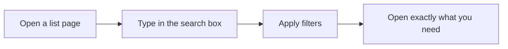

Menaia keeps everything in one consistent layout: a **sidebar** on the left to move between areas, a **top bar** with Meni and your notifications, and a main workspace that fills with whatever you're working on. Once you know how the sidebar is organized, you can find anything in a couple of clicks.

<Note>
Your sidebar only shows the areas your role can use, so it may be shorter than what you see here. That's normal — Menaia hides what you don't need.
</Note>

## Your home page: My Performance

When you log in, most people land on **My Performance** — your personal performance dashboard. It's a quick read on how things are going, with results, leaderboards, and trends for you and your team. If your company runs more than one branch, a **Branch / Company** toggle lets you switch between one location and the whole organization, and you can change the time period to see today, this week, or longer.

If your role doesn't have My Performance, you land on the first area your role uses instead — for example **Leads**.

<Tip>
Think of My Performance as your morning check-in: open it first to see where things stand before diving into the day's work. If Meni is turned on for you, the **Dashboard** is a second place to check in — see below.
</Tip>

## The sidebar, area by area

The sidebar groups related tools together so you can find them fast.

### Open, close, and collapse the sidebar

- **On a computer**, the arrow button at the top of the sidebar collapses it to icons only, so the main workspace gets more room. Hover over an icon to see its name. Press the arrow again to expand the sidebar.
- **On a phone or small tablet**, the sidebar is hidden. Tap the **menu** button (three lines) at the top left to open it, and the **X** to close it.

### Switch branches

If you work in more than one branch, a **branch selector** sits at the top of the sidebar, under the Menaia logo. Pick a branch to make it your active branch. Most lists and dashboards then show that branch's work, and new records you create go to that branch. The selector only appears when you belong to two or more branches, and it's hidden while the sidebar is collapsed.

For exactly what switching changes, see [Org branch scoping](/reference/platform/org-branch-scoping#what-changing-your-active-branch-changes).

### Groups

Your team's group feeds are listed under **Groups**, above the other areas. Click a group to open its feed, where you can post wins and updates and react to your teammates' posts. A number next to a group shows its unread posts. You only see the groups you've been given access to. See [Win feed](/guides/earnings/win-feed).

Admins also see a three-dots menu next to **Groups** with **New Group**, and one on each group with **Edit Group** and **Delete Group**. If there are no groups yet, Admins see **Create a Group** instead. See [Manage groups](/guides/earnings/manage-groups).

<Note>
If you don't see **Groups** in your sidebar, groups aren't turned on for your workspace, or you haven't been added to any.
</Note>

### Main

Your personal, everyday tools.

- **My Performance** — your dashboard of results and trends.
- **Dashboard** — Meni's home: what needs your attention, your morning briefing, drafts waiting for your approval, and the charts you've pinned from Meni. A number next to it shows how many drafts are waiting for you. See [Meni Dashboard](/guides/meni/dashboard).
- **Automations** — set up playbooks and watch rules so Meni drafts follow-up work for your approval. See [Automations](/guides/meni/automations).
- **Communications** — text and call your clients from one inbox. A number next to it shows your unread conversations.
- **Call Center** — a live view of the call queue, your agents, recent activity, and call and text volume.
- **Schedule** — the calendar of upcoming and assigned work.
- **My Wallet** — your earnings and pay-related details.

<Note>
**Dashboard** and **Automations** appear only when Meni and its automations are turned on for your workspace, and not for every role — Client Coordinators don't have them. **Communications** and **Call Center** appear when Communications is turned on for your workspace; Crew Members don't have them. See [Feature availability](/reference/platform/feature-availability).
</Note>

### Sales

Everything for winning new work.

- **Leads** — new inquiries and potential customers.
- **Clients** — your established customers and their properties.
- **T&M Calculator** — the step-by-step Calculator for building a new itemized estimate from your price book. See [Create an estimate](/guides/estimates/create).
- **Ride-Alongs** — capture and review field visits.
- **Estimates** — build, find, and manage itemized estimates.

### Jobs

Everything for getting the work done.

- **Jobs** — sold work to schedule, assign, and complete.
- **Shifts** — track the crew's time on the job.

### Admin

Company-wide oversight and setup (visible to managers and admins).

- **AI BI** — a built-in set of live charts and reports about your business.
- **Bonus Report** — track and reward team performance.
- **Invoices** — bill completed work and follow payments.
- **Integrations** — connect Menaia to the other tools you use.
- **Settings** — manage your workspace, team, and preferences.

### Your name menu

Your photo (or initials), name, and email sit at the bottom of the sidebar. Click them to open a menu:

- **View Profile** — see your profile the way teammates see it, with your wins and badges.
- **Edit Profile** — update your photo, contact details, working hours, and password. See [Your profile](/guides/start/your-profile).
- **Dark Mode** or **Light Mode** — switch the look of the app. The label shows the mode you'd switch to.
- **Sign out** — sign out of Menaia. See [Sign in](/guides/start/sign-in#sign-out).

The **sun** or **moon** button next to your name switches between light and dark mode in one click. Menaia remembers your choice on that browser.

## The top bar

The bar across the top of every page holds your workspace name (on larger screens) and a few quick tools on the right.

### Meni, your AI assistant

**Meni** is available from the top bar on every page. Click the **sparkles** button, or press **Cmd + J** (Mac) or **Ctrl + J** (Windows), to open the Meni panel and ask a question — how to do something in Menaia, or, when the full assistant is on for you, anything about your leads, jobs, schedule, and more. The **question-mark** button next to it opens Meni to report a problem.

See [Ask Meni](/guides/meni/ask-meni) for everything Meni can do.

### Notifications

The **bell** holds your in-app notifications. Click it to open your notification feed. Some notifications have a button that takes you straight to the related page.

- **On a computer**, the feed opens in a panel under the bell.
- **On a phone or small tablet**, the feed fills the screen under a **Notifications** heading. Press **Mark all as read** to clear the unread count, and the **Back** arrow to close it.

To control which notifications are sent by email, text, or in the app, see [Notification preferences](/guides/settings/notification-preferences).

<Note>
If you don't see the bell, in-app notifications aren't turned on for your workspace.
</Note>

### QuickBooks Sync Errors

If your workspace is connected to QuickBooks and some records failed to sync, Admins see a **QuickBooks Sync Errors** warning badge in the top bar. On small screens it shrinks to just the warning icon. Click it to open the QuickBooks **Sync Log**, where you can retry or ignore each error. The badge goes away once there are no errors left. See [Sync log](/guides/settings/integrations#sync-log).

## Settings: tailoring your workspace

The **Settings** area (under Admin) is where your workspace is shaped to fit how your company works — your team and their access, branch details, pricing, and the preferences that drive the rest of the product. You'll usually visit Settings to set things up or adjust them, not for day-to-day work.

<Tip>
If something in Menaia behaves differently than a teammate's — like a step that appears for them but not you — it's often a **branch setting**. Settings is where those differences are configured.
</Tip>

## Finding things fast with search

Most list pages — **Leads**, **Clients**, **Estimates**, **Jobs**, **Invoices** — give you a **search box** and **filters** at the top. Type a name, address, or keyword to narrow a long list down to what you're after, and use filters to focus on a status, a person, or a time range.

```mermaid
flowchart LR
  OPEN[Open a list page] --> SEARCH[Type in the search box]
  SEARCH --> FILTER[Apply filters]
  FILTER --> FOUND[Open exactly what you need]
```

<Tip>
Looking for one specific customer? Start in **Clients** and search their name — from there you can reach their properties, estimates, and jobs all in one place.
</Tip>

## Where to go next

<CardGroup cols={2}>
  <Card title="Core concepts" icon="shapes" href="/guides/start/core-concepts">
    Brush up on the building blocks behind each sidebar area.
  </Card>
  <Card title="Roles at a glance" icon="users" href="/guides/start/roles-at-a-glance">
    See which areas match your role.
  </Card>
  <Card title="Ask Meni" icon="sparkles" href="/guides/meni/ask-meni">
    Get answers and help from Menaia's AI assistant.
  </Card>
</CardGroup>
