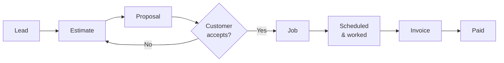

Every piece of work in Menaia travels the same path, from the first time you hear about a customer to the moment you get paid. Understanding this flow is the fastest way to feel at home — once you know the stages, you'll always know where you are and what comes next.

<Note>
Work moves in one direction, but it's never a one-way street. You can reopen an estimate, reschedule a job, or update a client at any point. The flow below is the *happy path* — the typical journey when everything goes smoothly.
</Note>

## The journey at a glance

## The stages, one by one

<Steps>
  <Step title="Lead — someone's interested">
    A new inquiry comes in and becomes a **Lead**. This is a potential customer who hasn't bought yet. Your team captures their details and starts working to win the job.
  </Step>
  <Step title="Client & Property — get them set up">
    As the Lead turns into real business, you connect it to a **Client** (the customer) and a **Property** (the address where the work happens). This keeps everything tied to the right person and place.
  </Step>
  <Step title="Estimate — price the work">
    Using the **Calculator**, you build an **Estimate** — an itemized breakdown of the work and its price. The Calculator handles the math; you describe the job accurately.
  </Step>
  <Step title="Proposal — share it with the customer">
    Turn the Estimate into a **Proposal** — the clean, customer-facing version — and send it for the customer to review and accept.
  </Step>
  <Step title="Sold — the customer says yes">
    When the customer accepts, you mark the estimate **Sold**. That's the signal that this is now real, won work ready to be done.
  </Step>
  <Step title="Job — do the work">
    The sold estimate becomes a **Job**. You put it on the **Schedule**, assign a crew, and the team gets it done. As they work, time is tracked with **Shifts**.
  </Step>
  <Step title="Invoice — get paid">
    Once the Job is complete, you send an **Invoice** for the work and track it through to payment.
  </Step>
</Steps>

## Why the flow matters

Because every stage links to the next, anyone on your team can pick up where someone else left off. A salesperson builds the estimate, a coordinator schedules the job, a crew leader logs the hours, and an admin sends the invoice — all looking at the same connected record.

<Tip>
Lost track of where something stands? Open the **Client** to see their full history, or check the relevant list — **Estimates**, **Jobs**, or **Invoices** — and the status tells you exactly which stage the work is in.
</Tip>

## Where to go next

<CardGroup cols={2}>
  <Card title="Core concepts" icon="shapes" href="/guides/start/core-concepts">
    Get the plain-language definitions behind each stage.
  </Card>
  <Card title="Create an estimate" icon="calculator" href="/guides/estimates/create">
    Jump into the Calculator and build your first estimate.
  </Card>
</CardGroup>
