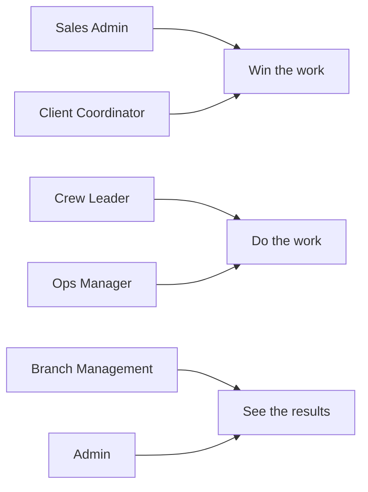

Menaia is built for teams, so different people see different parts of it. Your **role** decides which areas show up in your sidebar and what you can do in each one. This page is a quick map of who's who — so you can recognize your own role and understand what your teammates handle.

<Note>
You don't pick your own role — an administrator sets it for you. If you think you're missing access to something you need, that's the person to ask.
</Note>

## The roles

<CardGroup cols={2}>
  <Card title="Sales Admin" icon="filter">
    Owns the top of the funnel. Works **Leads**, manages **Clients**, builds **Estimates** with the Calculator, and sends **Proposals**. Their day is about turning interest into sold work.
  </Card>
  <Card title="Client Coordinator" icon="headset">
    Keeps customers and their details in order. Sets up and maintains **Clients** and **Properties**, and helps make sure the right work is tied to the right customer and address.
  </Card>
  <Card title="Crew Leader" icon="hard-hat">
    Runs the work on the ground. Picks up assigned **Jobs**, works from the **Schedule**, and logs the team's time with **Shifts**. Focused on getting jobs done well and on time.
  </Card>
  <Card title="Ops Manager" icon="clipboard-list">
    Keeps operations moving. Oversees the **Schedule** and **Jobs**, balances crews and workload, and makes sure sold work actually gets completed.
  </Card>
  <Card title="Branch Management" icon="building">
    Looks after a single branch. Reviews results for their location, keeps the branch's people and settings in shape, and makes sure their team is hitting its goals.
  </Card>
  <Card title="Admin" icon="shield-check">
    Has the broad, company-wide view. Manages **Settings**, **Invoices**, **Integrations**, and team members, and uses **AI BI** and the **Bonus Report** to track and reward performance.
  </Card>
</CardGroup>

## What this means for you

Roles aren't rigid job titles — they're about access. Many people do a little of several things, and Menaia simply shows each person the tools their role allows.

<Tip>
The simplest way to understand your role: look at your sidebar. The sections you can see are the ones meant for you. If a teammate sees a section you don't, that's just their role doing a different part of the job.
</Tip>

## Where to go next

<CardGroup cols={2}>
  <Card title="Finding your way around" icon="compass" href="/guides/start/finding-your-way-around">
    See how the sidebar groups the areas each role uses.
  </Card>
  <Card title="How work flows" icon="arrow-right-arrow-left" href="/guides/start/how-work-flows">
    See how these roles hand work off to one another.
  </Card>
</CardGroup>
