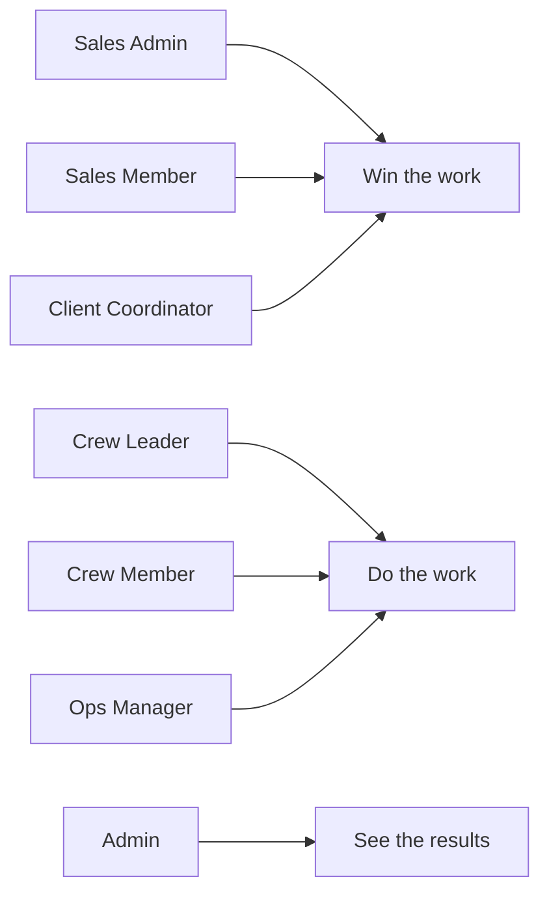

Menaia is built for teams, so different people see different parts of it. Your role decides which areas show up in your sidebar and what you can do in each one. 

<Note>
  You don't pick your own role — an administrator sets it for you. If you think you're missing access to something you need, that's the person to ask.
</Note>

## The roles

<CardGroup cols={2}>
  <Card title="Sales Admin" icon="filter">
    Owns the top of the funnel. Works Leads, manages Clients, builds Estimates with the T&M Calculator, records Ride-Alongs, and sends Proposals. Talks to customers from Communications and the Call Center, and sees the Dashboard when the sales overview is turned on. Their day is about turning interest into sold work.
  </Card>

  <Card title="Sales Member" icon="user-plus">
    Works the sales floor. Builds Estimates with the T&M Calculator, manages Clients, sends Proposals, and works Jobs from the Schedule. Texts and calls customers from Communications and the Call Center, and sees the Dashboard when the sales overview is turned on. Unlike a Sales Admin, they don't work Leads — their day starts from Clients and Estimates.
  </Card>

  <Card title="Client Coordinator" icon="headset">
    Keeps customers and their details in order. Sets up and maintains Leads, Clients, and Properties, and helps make sure the right work is tied to the right customer and address. Handles customer texts and calls in Communications and the Call Center.
  </Card>

  <Card title="Crew Leader" icon="hard-hat">
    Runs the work on the ground. Picks up assigned Jobs, works from the Schedule, and logs the team's time with Shifts. Checks the Dashboard and Automations, reaches customers from Communications and the Call Center, and tracks results in My Performance and My Wallet. Focused on getting jobs done well and on time.
  </Card>

  <Card title="Crew Member" icon="user-helmet-safety">
    Part of the crew getting jobs done. Sees their Schedule, logs time with Shifts, checks the Dashboard and Automations, and tracks their own results in My Performance and My Wallet.
  </Card>

  <Card title="Ops Manager" icon="clipboard-list">
    Keeps operations moving. Oversees the Schedule and Jobs, balances crews and workload, and makes sure sold work actually gets completed. Works from the Dashboard and Automations, keeps up with customers in Communications and the Call Center, and uses AI BI and the Bonus Report to track results.
  </Card>

  <Card title="Admin" icon="shield-check">
    Has the broad, company-wide view. Starts from the Dashboard and Automations, keeps an eye on Communications and the Call Center, and runs the Admin area: AI BI, the Bonus Report, Invoices, Integrations, and Settings, including team members.
  </Card>
</CardGroup>

Everyone can ask **Meni**, Menaia's AI assistant, from the top bar. **Dashboard** and **Automations** only show up when Meni is turned on for your workspace, and Communications and the Call Center only when texting and calling are. See [Ask Meni](/guides/meni/ask-meni) and [Feature availability](/reference/platform/feature-availability).

## What this means for you

Roles aren't rigid job titles — they're about access. Many people do a little of several things, and Menaia simply shows each person the tools their role allows.

```mermaid
flowchart LR
  SA[Sales Admin] --> WIN[Win the work]
  SM[Sales Member] --> WIN
  CC[Client Coordinator] --> WIN
  CL[Crew Leader] --> DO[Do the work]
  CM[Crew Member] --> DO
  OM[Ops Manager] --> DO
  AD[Admin] --> SEE[See the results]
```

<Tip>
  The simplest way to understand your role: look at your sidebar. The sections you can see are the ones meant for you. If a teammate sees a section you don't, that's just their role doing a different part of the job.
</Tip>

## Where to go next

<CardGroup cols={2}>
  <Card title="Finding your way around" icon="compass" href="/guides/start/finding-your-way-around">
    See how the sidebar groups the areas each role uses.
  </Card>

  <Card title="How work flows" icon="arrow-right-arrow-left" href="/guides/start/how-work-flows">
    See how these roles hand work off to one another.
  </Card>
</CardGroup>