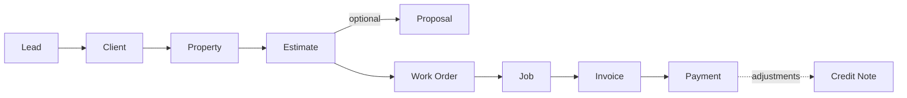

This guide walks through the complete revenue pipeline — from the moment a prospect first reaches out, all the way to a fully paid invoice. Each stage produces a record that feeds the next, so nothing is re-entered by hand as work moves from sales to operations to accounting.

## The seven stages

<Steps>
  <Step title="Lead">
    A prospective customer enters the system with a contact and a source. Sales qualifies and nurtures it.
  </Step>
  <Step title="Client & property">
    A qualified lead converts into a **client** account with one or more **properties** — the physical locations where work happens.
  </Step>
  <Step title="Estimate">
    A priced quote is built from the service catalog and moves through _In Progress → Sold → Released_.
  </Step>
  <Step title="Proposal">
    An optional customer-facing document with payment options and an e-signature that formalizes the agreement.
  </Step>
  <Step title="Work order">
    The sold scope becomes crew-ready line items, grouped by work area at the property.
  </Step>
  <Step title="Job">
    Operations assigns a crew, builds a day-by-day plan, schedules it, and runs the work to completion.
  </Step>
  <Step title="Invoice & payment">
    The client is billed, payments are recorded and allocated, and credit notes handle any adjustments.
  </Step>
</Steps>

## How the stages connect

## Where to go next

<CardGroup cols={2}>
  <Card title="Leads" icon="user-plus" href="/leads-to-invoices/leads">
    Capture, qualify, and track prospects.
  </Card>

  <Card title="Clients & properties" icon="house" href="/leads-to-invoices/clients-and-properties">
    Turn a won lead into an account and service locations.
  </Card>

  <Card title="Estimates" icon="file-invoice-dollar" href="/leads-to-invoices/estimates">
    Build and send priced quotes.
  </Card>

  <Card title="Invoices & payments" icon="receipt" href="/leads-to-invoices/invoices-and-payments">
    Bill the customer and collect payment.
  </Card>
</CardGroup>

<Info>
  This documentation describes the product workflow. Exact status names and options can vary by organization, since several lists (such as lead statuses) are configurable per workspace.
</Info>